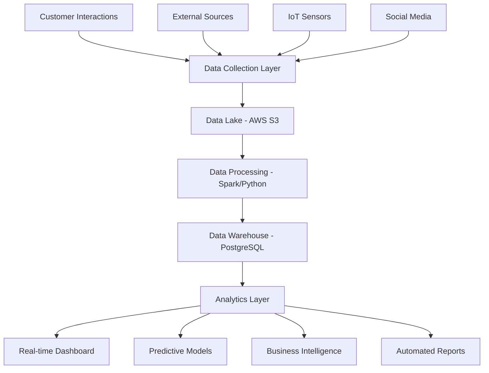

# Big Data Analysis Implementation Strategy
## StudyHub Café - Tashkent, Uzbekistan

---

## 1. BDA Tools and Technologies

### 1.1 Core Analytics Stack

**Python Ecosystem**
```python
# Primary Libraries
import pandas as pd           # Data manipulation and analysis
import numpy as np           # Numerical computing
import matplotlib.pyplot as plt  # Basic plotting
import seaborn as sns        # Statistical data visualization
import plotly.express as px  # Interactive visualizations
import scikit-learn as sklearn  # Machine learning
```

**Database and Storage**
- **PostgreSQL**: Customer data, transactions, loyalty programs
- **MongoDB**: Social media data, reviews, unstructured feedback
- **Redis**: Real-time cache for live analytics dashboard
- **AWS S3**: Data lake for historical data storage

**Visualization and BI**
- **Tableau Public**: Customer-facing dashboards and reports
- **Jupyter Notebooks**: Ad-hoc analysis and experimentation
- **Streamlit**: Internal web apps for staff analytics access
- **Google Data Studio**: Marketing campaign performance tracking

### 1.2 Data Collection Tools

**Customer Interaction Data**
- **POS System API**: Square/Toast integration for sales data
- **WiFi Analytics**: Customer flow and dwell time analysis
- **Mobile App**: Study session tracking, preferences, feedback
- **IoT Sensors**: Occupancy, noise levels, environmental conditions

**External Data Sources**
- **Social Media APIs**: Instagram, Facebook, Telegram for sentiment analysis
- **Google Analytics**: Website traffic and user behavior
- **Weather API**: Correlation between weather and customer patterns
- **Competitor Intelligence**: Web scraping for pricing and promotions

### 1.3 Technology Procurement Strategy

**Cloud Infrastructure (AWS)**
- **EC2 Instances**: Data processing and model training
- **RDS**: Managed database services
- **Lambda**: Serverless functions for real-time processing
- **QuickSight**: Business intelligence dashboards

**Budget Allocation for Technology**
| Tool/Service | Monthly Cost (USD) | Annual Cost (USD) | Purpose |
|--------------|-------------------|-------------------|---------|
| AWS Infrastructure | $200 | $2,400 | Cloud computing, storage |
| Tableau License | $70 | $840 | Data visualization |
| Advanced Analytics Tools | $100 | $1,200 | ML models, predictions |
| Data Integration Tools | $80 | $960 | ETL processes |
| Monitoring & Security | $50 | $600 | Data protection, uptime |
| **Total** | **$500** | **$6,000** | **12% of total budget** |

---

## 2. Data Architecture and Process Flow

### 2.1 Data Collection Framework



### 2.2 Real-time Data Pipeline

**Stage 1: Data Ingestion**
- Real-time streaming from POS systems
- Batch processing of daily social media data
- Continuous IoT sensor data collection
- Regular competitor data scraping

**Stage 2: Data Processing**
- Data cleaning and validation
- Feature engineering for ML models
- Aggregation for reporting and dashboards
- Data quality monitoring and alerts

**Stage 3: Analytics and Insights**
- Customer segmentation analysis
- Demand forecasting models
- Sentiment analysis of customer feedback
- Operational optimization recommendations

### 2.3 Key Analytics Workflows

**Customer Behavior Analysis**
1. Track individual customer journeys
2. Identify patterns in study sessions and purchases
3. Segment customers based on behavior and preferences
4. Generate personalized recommendations

**Operational Analytics**
1. Monitor real-time occupancy and queue management
2. Optimize staff scheduling based on predicted demand
3. Inventory management and waste reduction
4. Energy consumption optimization

**Marketing Analytics**
1. Campaign performance measurement
2. Customer acquisition channel analysis
3. Social media sentiment tracking
4. Competitor benchmarking

---

## 3. Privacy Policy and Data Governance

### 3.1 Data Collection Transparency

**Customer Consent Framework**
- Clear opt-in mechanisms for data collection
- Granular consent for different data types
- Easy opt-out processes
- Regular consent renewal requests

**Data Minimization Principles**
- Collect only necessary data for business purposes
- Implement data retention policies (24 months for transaction data)
- Regular data audits and cleanup processes
- Anonymization of sensitive personal information

### 3.2 Privacy Policy Structure

**1. Information We Collect**
- Personal Information: Name, email, phone number
- Usage Data: Study session duration, beverage preferences
- Technical Data: Device information, IP address
- Location Data: Check-in patterns (with explicit consent)

**2. How We Use Information**
- Service improvement and personalization
- Marketing communications (with consent)
- Operational analytics and optimization
- Customer support and communication

**3. Data Sharing and Third Parties**
- No sale of personal data to third parties
- Limited sharing with service providers (payment processors, cloud providers)
- Aggregated, anonymized data for market research
- Compliance with legal requirements

**4. Data Security Measures**
- Encryption in transit and at rest
- Regular security audits and penetration testing
- Staff training on data protection
- Incident response procedures

**5. User Rights**
- Access to personal data
- Data portability and export
- Correction of inaccurate information
- Deletion of personal data upon request

### 3.3 Compliance Framework

**Local Regulations (Uzbekistan)**
- Compliance with Uzbekistan data protection laws
- Local data residency requirements
- Government reporting obligations

**International Standards**
- GDPR-compliant processes for EU customers
- ISO 27001 security standards implementation
- Regular compliance audits and assessments

---

## 4. Analytics Use Cases and Applications

### 4.1 Customer Experience Optimization

**Personalized Recommendations**
```python
# Customer preference analysis
def analyze_customer_preferences(customer_id):
    # Analyze purchase history, study patterns, time preferences
    purchase_data = get_customer_purchases(customer_id)
    study_patterns = get_study_sessions(customer_id)
    
    # Generate personalized recommendations
    beverage_recommendations = recommend_beverages(purchase_data)
    optimal_study_times = predict_best_study_times(study_patterns)
    
    return {
        'beverages': beverage_recommendations,
        'study_times': optimal_study_times,
        'seating_preferences': analyze_seating_patterns(customer_id)
    }
```

**Dynamic Pricing Strategy**
```python
# Demand-based pricing model
def calculate_dynamic_pricing(time_slot, day_of_week, occupancy_forecast):
    base_price = get_base_pricing()
    demand_multiplier = calculate_demand_factor(time_slot, day_of_week)
    occupancy_factor = adjust_for_occupancy(occupancy_forecast)
    
    final_price = base_price * demand_multiplier * occupancy_factor
    return round(final_price, 2)
```

### 4.2 Operational Intelligence

**Demand Forecasting**
```python
# Predict customer demand for capacity planning
import sklearn.ensemble as ensemble
from sklearn.model_selection import train_test_split

def forecast_daily_demand():
    # Feature engineering
    features = create_demand_features()  # weather, events, holidays, historical
    
    # Random Forest model for demand prediction
    model = ensemble.RandomForestRegressor(n_estimators=100)
    model.fit(features, historical_demand)
    
    # Predict next 7 days
    future_demand = model.predict(future_features)
    return future_demand
```

**Inventory Optimization**
```python
# Optimize inventory based on predicted demand and historical patterns
def optimize_inventory():
    demand_forecast = get_demand_forecast()
    historical_sales = get_sales_data()
    
    # Calculate optimal inventory levels
    for item in menu_items:
        safety_stock = calculate_safety_stock(item)
        reorder_point = calculate_reorder_point(item, demand_forecast)
        optimal_quantity = economic_order_quantity(item)
        
        inventory_recommendations[item] = {
            'current_stock': get_current_stock(item),
            'reorder_point': reorder_point,
            'order_quantity': optimal_quantity
        }
    
    return inventory_recommendations
```

### 4.3 Marketing Analytics

**Customer Segmentation**
```python
# RFM Analysis for customer segmentation
def customer_segmentation():
    # Recency, Frequency, Monetary analysis
    customer_data = get_customer_transaction_data()
    
    # Calculate RFM scores
    rfm_data = calculate_rfm_scores(customer_data)
    
    # K-means clustering for segmentation
    from sklearn.cluster import KMeans
    kmeans = KMeans(n_clusters=5)
    segments = kmeans.fit_predict(rfm_data)
    
    return create_segment_profiles(segments)
```

**Campaign Effectiveness Analysis**
```python
# Measure marketing campaign ROI
def analyze_campaign_effectiveness(campaign_id):
    campaign_data = get_campaign_data(campaign_id)
    customer_response = get_customer_responses(campaign_id)
    
    # Calculate key metrics
    metrics = {
        'reach': len(campaign_data['recipients']),
        'engagement_rate': calculate_engagement_rate(customer_response),
        'conversion_rate': calculate_conversion_rate(customer_response),
        'roi': calculate_campaign_roi(campaign_id),
        'customer_acquisition_cost': calculate_cac(campaign_id)
    }
    
    return metrics
```

---

## 5. Implementation Roadmap

### Phase 1: Foundation (Months 1-2)
- Set up basic data collection infrastructure
- Implement POS system integration
- Deploy customer feedback collection system
- Basic reporting dashboards

### Phase 2: Enhancement (Months 3-4)
- Advanced analytics capabilities
- Customer segmentation models
- Predictive analytics for demand forecasting
- Marketing automation integration

### Phase 3: Optimization (Months 5-6)
- Machine learning model refinement
- Real-time personalization features
- Advanced operational analytics
- Competitive intelligence automation

### Phase 4: Scaling (Months 7-12)
- Multi-location data integration
- Advanced predictive models
- Customer behavior prediction
- Automated decision-making systems

---

## 6. Success Metrics and KPIs

### 6.1 Data Quality Metrics
- Data completeness: >95%
- Data accuracy: >98%
- Real-time processing latency: <5 seconds
- System uptime: >99.5%

### 6.2 Business Impact Metrics
- Customer satisfaction improvement: +15%
- Operational efficiency gains: +20%
- Marketing ROI improvement: +25%
- Revenue per customer increase: +18%

### 6.3 Analytics Adoption Metrics
- Staff usage of analytics tools: >80%
- Data-driven decision percentage: >70%
- Time saved through automation: 10 hours/week
- Prediction accuracy: >85%

---

## Conclusion

This comprehensive BDA implementation strategy provides StudyHub Café with the foundation for data-driven decision making across all business functions. By leveraging existing tools and technologies while maintaining strict privacy standards, the café can achieve significant competitive advantages in the Tashkent market.

The phased implementation approach ensures manageable complexity while delivering immediate value, with each phase building upon the previous to create a sophisticated analytics ecosystem that scales with business growth.
