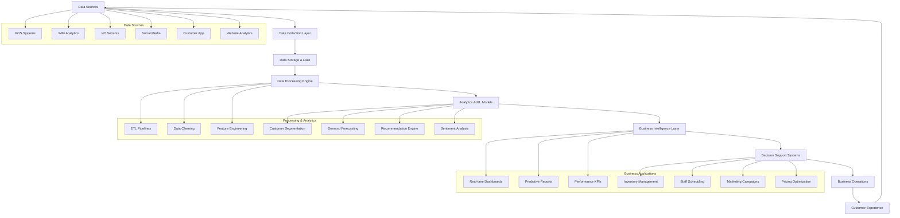
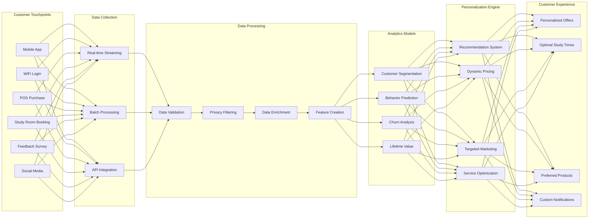
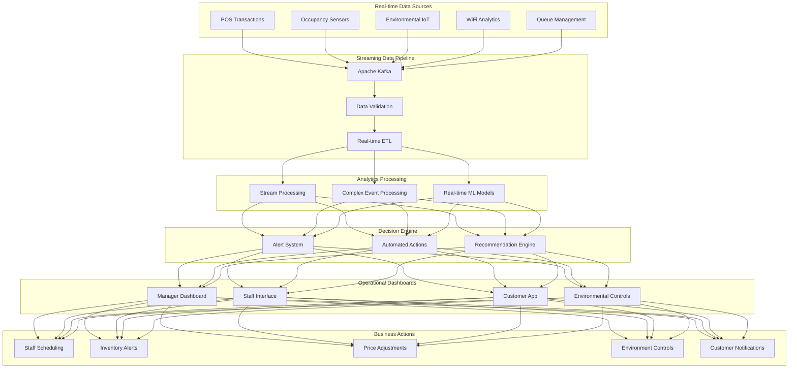
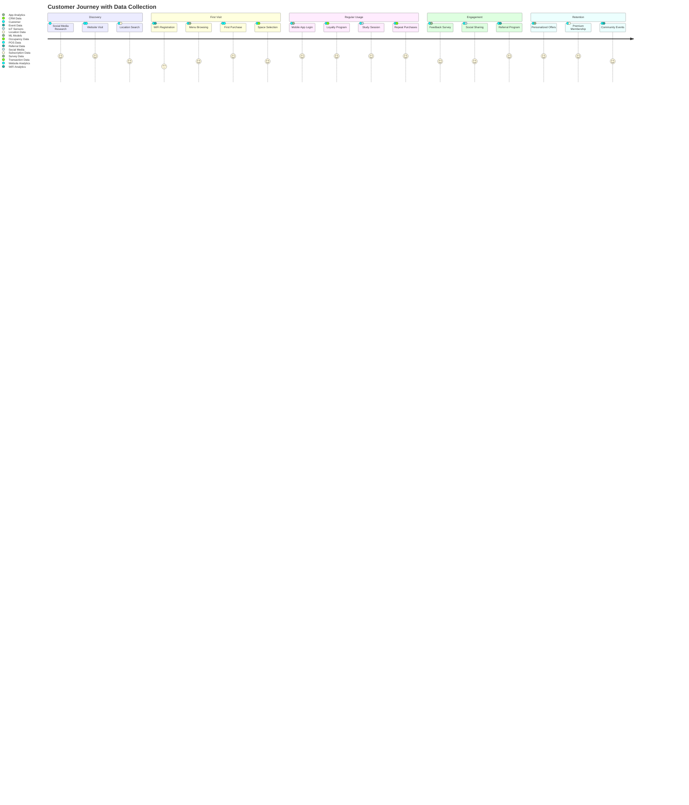
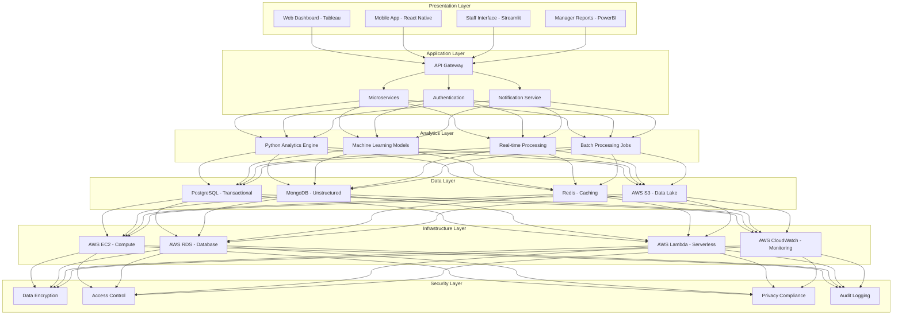
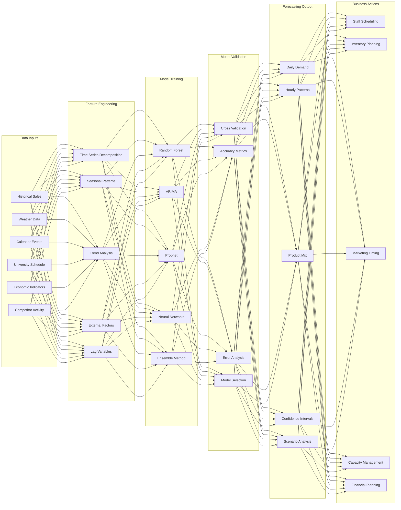
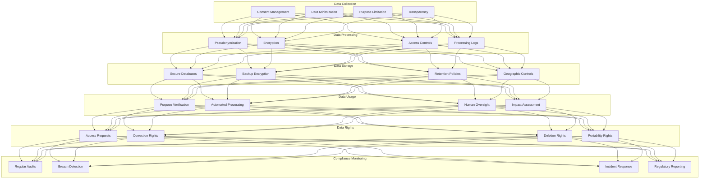
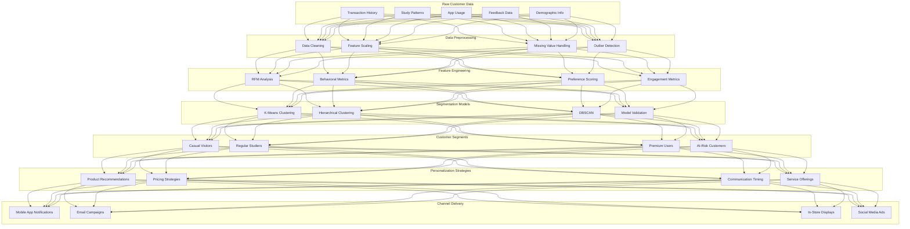
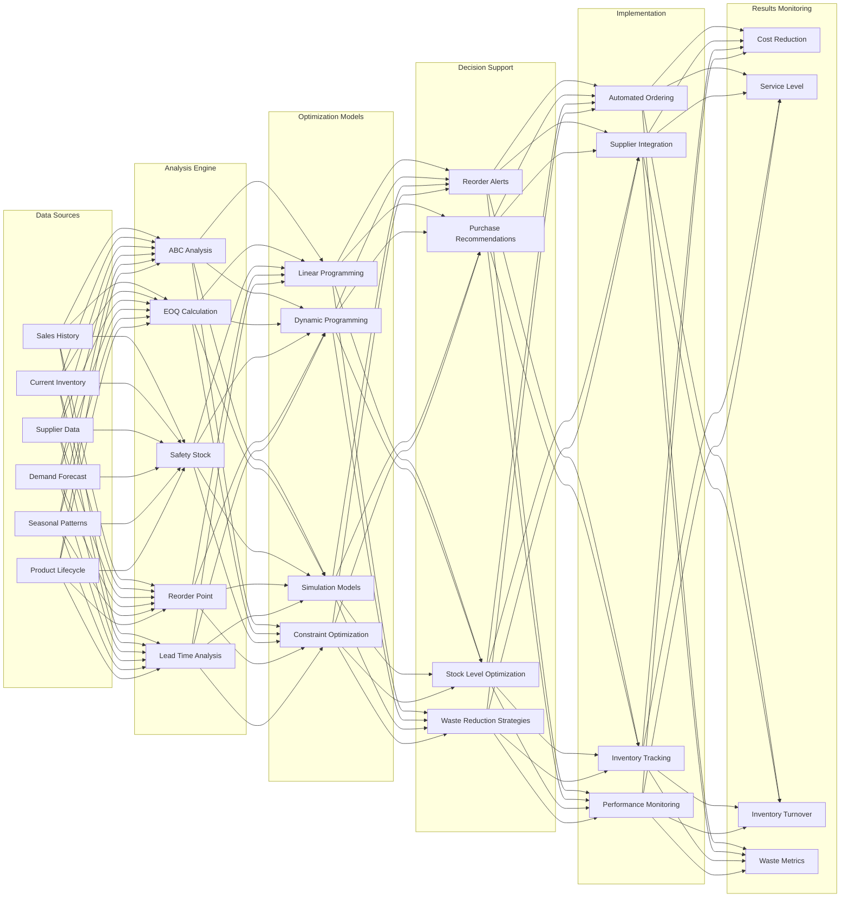
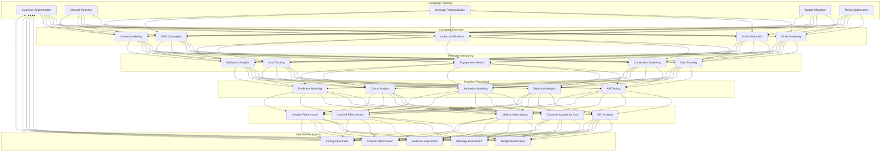

# Process Flow Diagrams and Schematics
## StudyHub Café Big Data Analysis Implementation

---

## **Diagram 1: Overall Big Data Analytics Process Flow**

---

## **Diagram 2: Customer Data Collection and Analysis Pipeline**

---

## **Diagram 3: Real-time Operational Analytics Architecture**

---

## **Diagram 4: Customer Journey and Data Touchpoints**

---

## **Diagram 5: Technology Stack Architecture**

---

## **Diagram 6: Demand Forecasting Process**

---

## **Diagram 7: Privacy and Data Governance Framework**

---

## **Diagram 8: Customer Segmentation and Personalization Flow**

---

## **Diagram 9: Inventory Optimization Process**

---

## **Diagram 10: Marketing Analytics and Campaign Optimization**

---

## **Implementation Notes for Diagrams**

### **Tools for Creating Diagrams**
1. **Mermaid.js**: For interactive flowcharts and process diagrams
2. **Lucidchart**: For professional business process diagrams
3. **Draw.io**: For technical architecture diagrams
4. **Microsoft Visio**: For detailed system architecture
5. **Tableau**: For data flow visualizations

### **Color Coding Conventions**
- **Blue**: Data sources and inputs
- **Green**: Processing and transformation
- **Orange**: Analytics and models
- **Red**: Outputs and actions
- **Purple**: Monitoring and feedback loops

### **Diagram Usage in Presentation**
1. **Sequential Presentation**: Show diagrams in logical order of implementation
2. **Interactive Elements**: Use clickable areas to drill down into details
3. **Animation**: Progressive disclosure of diagram elements
4. **Annotations**: Highlight key decision points and data flows
5. **Real Examples**: Overlay actual data on process diagrams where possible

These comprehensive process flow diagrams provide visual clarity for the complex big data analytics implementation at StudyHub Café. Each diagram focuses on a specific aspect of the system while showing how all components integrate into a cohesive analytics ecosystem. The visual representations make it easier to understand the data flow, decision points, and business value creation throughout the entire analytics pipeline.
